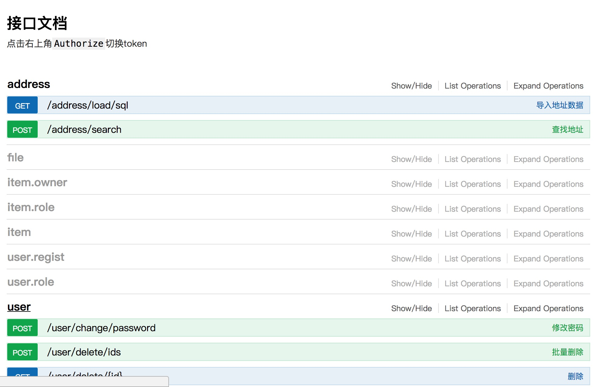

# gev2 

一个基于 [gin](https://github.com/gin-gonic/gin) 的 restful 框架

``` bash
# 安装
go get github.com/inu1255/gev2
```

### 目录结构
```
├── convert.go    将成员函数转换为接口
├── parse.go      获取成员函数注释
├── service.go    service注册
├── helper.go     辅助函数
├── error.go      包装json数据
├── config.go     全局变量
├── base.go       基础service类
├── class.go      模拟java的类，具有重载功能
├── models        一些常用 service
│   └── ...
├── example       示例
│   └── ...
├── config        数据库配置
│   └── config.go
└── README.md
```

### 示例 (modelmain.go)

``` go
package main

import (
    "github.com/inu1255/gev2"
    "github.com/inu1255/gev2/config"
    . "github.com/inu1255/gev2/models"
    "github.com/inu1255/go-swagger/core"
)

func main() {
    config.SetDb("mysql", "root:199337@/gev2?parseTime=true")
    core.CopySwagger()
    gev2.App.Static("api", "api")
    gev2.App.Use(UserMW(new(UserRoleModel)))
    gev2.App.Use(gev2.CrossDomainMW())

    UserVerify = NewModel(new(VerifyModel)).(IVerifyModel)
    gev2.Bind("address", new(AddressModel))
    gev2.Bind("file", new(FileModel))
    gev2.Bind("item", new(ItemModel))
    gev2.Bind("item.owner", new(ItemOwnerModel))
    gev2.Bind("item.role", new(ItemRoleModel))
    gev2.Bind("user", new(UserModel))
    gev2.Bind("user.regist", new(UserRegistModel))
    gev2.Bind("user.role", new(UserRoleModel))
    gev2.Bind("verify", new(VerifyModel))
    gev2.Bind("verify.mail", new(VerifyMailModel))
    gev2.Run(":8019")
}
```

### 运行

``` bash
go run modelmain.go
```
访问 [http://localhost:8019/api/](http://localhost:8019/api/)

